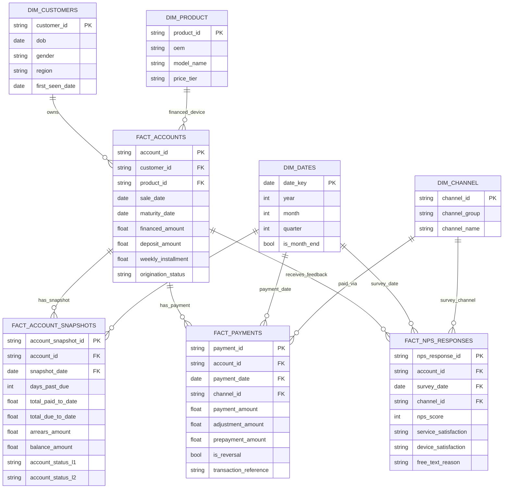
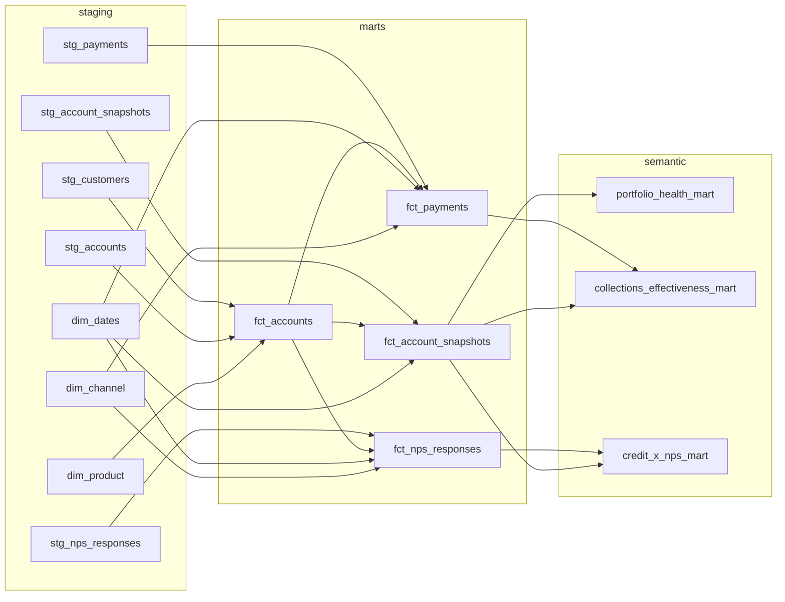

# MoPhones Reporting Data Model (ERD + dbt-style DAG)

This is a simple, production-oriented model for repeatable portfolio and customer-experience reporting.

## 1) ERD (Business Entities)

## 2) dbt-style DAG (Transformation Layers)

## 3) Why this structure works

- `fact_account_snapshots` gives period-level risk reporting (PAR, DPD migration, default stock).
- `fact_payments` enables true collections analysis (cure curves, PTP behavior, channel effectiveness).
- `fact_nps_responses` allows credit performance to be measured against customer outcomes.
- Shared dimensions (`dates`, `channel`, `product`, `customers`) make reporting consistent and auditable.

## 4) Minimum governance rules

1. **Single account key standard** across source systems (`account_id`).
2. **Status dictionary** with controlled values + change log (`account_status_l1/l2`).
3. **Snapshot SLA** (e.g., monthly close + T+2 refresh) and data tests (nulls, uniqueness, referential integrity).
